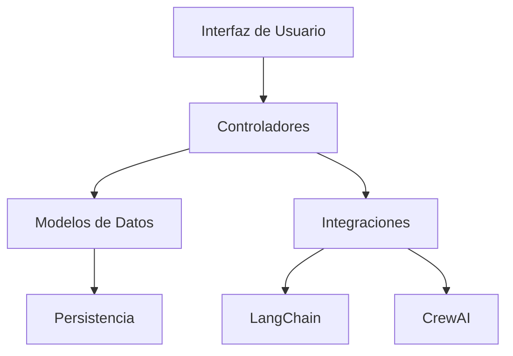
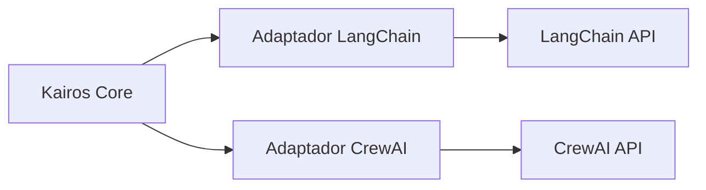
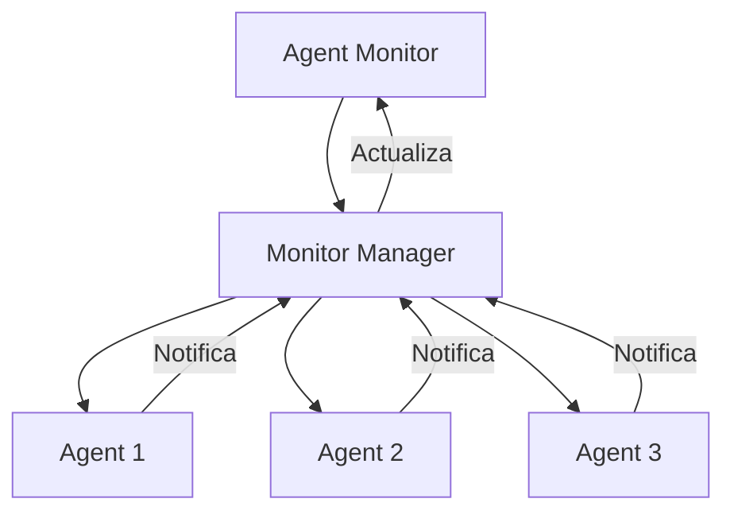
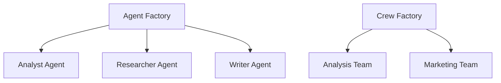
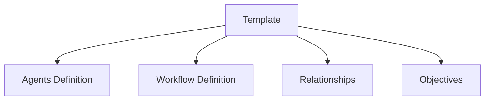
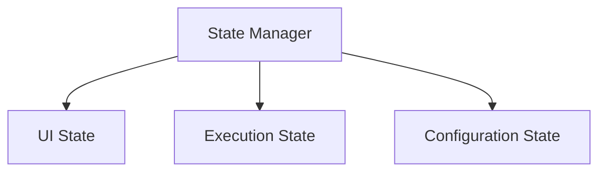
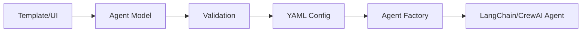
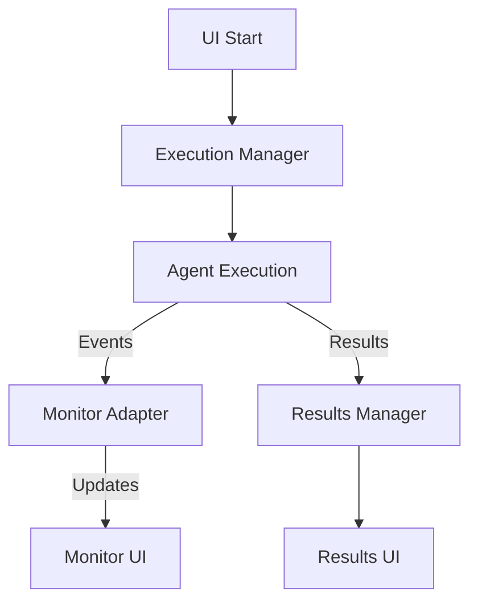
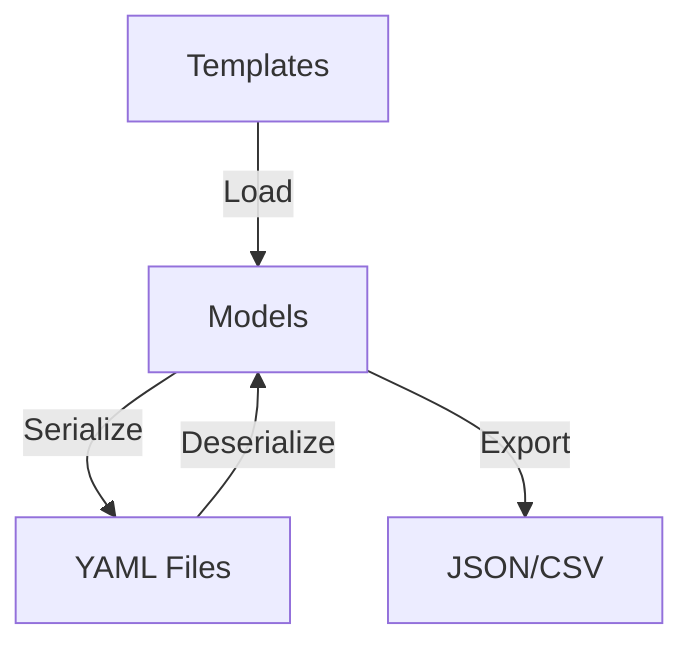

# Kairos - Patrones del Sistema

## Arquitectura General

Kairos sigue una arquitectura modular basada en el patrón MVC (Modelo-Vista-Controlador) adaptado para aplicaciones de escritorio con PyQt6:

### Componentes Principales

1. **Interfaz de Usuario (UI)**
   - Implementada con PyQt6
   - Organizada en paneles modulares
   - Sigue un flujo de trabajo secuencial

2. **Modelos de Datos**
   - Representación de agentes, tareas y equipos
   - Validación y transformación de datos
   - Serialización/deserialización para persistencia

3. **Controladores**
   - Gestión del flujo de trabajo
   - Coordinación entre UI y modelos
   - Manejo de eventos y acciones

4. **Integraciones**
   - Adaptadores para diferentes frameworks
   - Abstracción de APIs externas
   - Conversión entre formatos de datos

5. **Persistencia**
   - Almacenamiento en archivos YAML
   - Gestión de configuraciones
   - Exportación/importación de datos

## Patrones de Diseño Clave

### 1. Patrón Adaptador

Utilizado para integrar diferentes frameworks de agentes (LangChain, CrewAI) con una interfaz unificada:

**Implementación:**
- `langchain_integration/agent_factory.py`: Crea agentes LangChain
- `langchain_integration/team_manager.py`: Gestiona equipos LangChain
- `langchain_integration/agent_monitor_adapter.py`: Conecta monitorización con LangChain

### 2. Patrón Observador

Implementado para la monitorización de agentes en tiempo real:

**Implementación:**
- `ui/agent_monitor.py`: Panel de monitorización (observador)
- `langchain_integration/agent_monitor_adapter.py`: Gestor de monitores (sujeto)
- Agentes: Notifican eventos al gestor

### 3. Patrón Fábrica

Utilizado para crear diferentes tipos de agentes y equipos:

**Implementación:**
- `models/agent_model.py`: Definición de agentes
- `models/crew_model.py`: Definición de equipos
- `langchain_integration/agent_factory.py`: Creación de agentes LangChain

### 4. Patrón Plantilla

Implementado para definir flujos de trabajo reutilizables:

**Implementación:**
- `models/template_model.py`: Definición de plantillas
- `config/templates/*.yaml`: Plantillas predefinidas
- `ui/template_panel.py`: UI para gestión de plantillas

### 5. Patrón Estado

Utilizado para gestionar el estado de la aplicación y la ejecución de agentes:

**Implementación:**
- `models/state_manager.py`: Gestión centralizada del estado
- Estados de ejecución: Idle, Running, Paused, Completed, Error

## Flujos de Datos

### 1. Configuración de Agentes

### 2. Ejecución y Monitorización

### 3. Persistencia de Datos

## Principios Arquitectónicos

1. **Separación de Responsabilidades**
   - UI separada de la lógica de negocio
   - Adaptadores para integraciones externas
   - Modelos independientes de la presentación

2. **Extensibilidad**
   - Arquitectura modular para añadir nuevas funcionalidades
   - Interfaces bien definidas entre componentes
   - Soporte para plugins y extensiones

3. **Usabilidad**
   - Flujo de trabajo guiado paso a paso
   - Feedback visual inmediato
   - Gestión de errores amigable

4. **Rendimiento**
   - Operaciones asíncronas para tareas largas
   - Optimización de uso de recursos
   - Caché para operaciones frecuentes

## Desafíos Técnicos

1. **Integración con Frameworks Externos**
   - Diferencias en APIs y modelos de datos
   - Cambios frecuentes en versiones
   - Comportamientos inconsistentes

2. **Monitorización en Tiempo Real**
   - Latencia en actualizaciones
   - Sobrecarga de información
   - Precisión en métricas

3. **Gestión de Estado**
   - Sincronización entre componentes
   - Recuperación de errores
   - Persistencia confiable

## Evolución Arquitectónica

La arquitectura ha evolucionado desde un enfoque monolítico inicial hacia un sistema más modular y extensible:

1. **Fase Inicial**
   - Integración directa con CrewAI
   - UI acoplada a la lógica de negocio
   - Configuración limitada

2. **Fase Actual**
   - Arquitectura modular con adaptadores
   - Soporte para múltiples frameworks
   - Separación clara de responsabilidades

3. **Dirección Futura**
   - Mayor modularidad con sistema de plugins
   - API para integraciones externas
   - Arquitectura distribuida para escalabilidad
